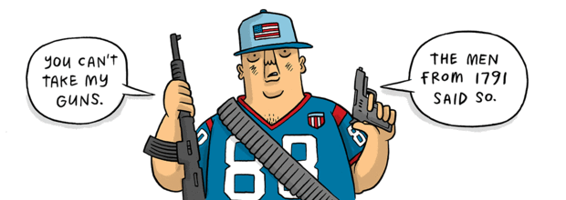
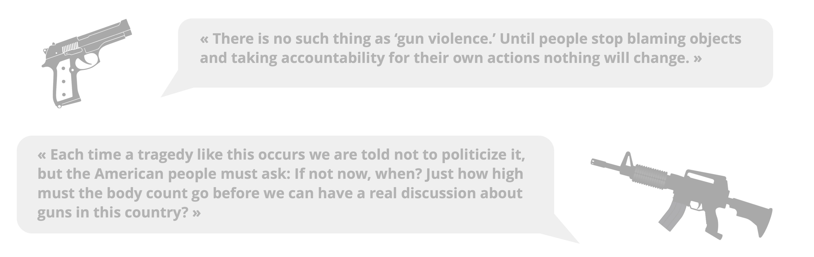
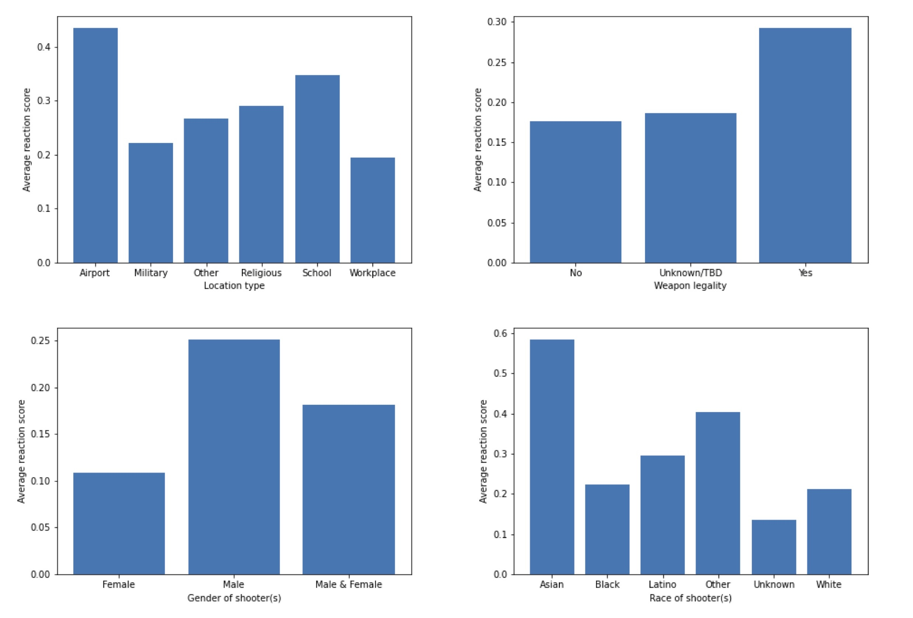
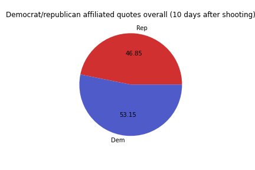
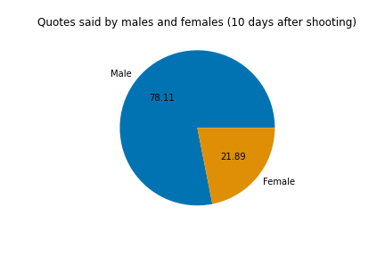
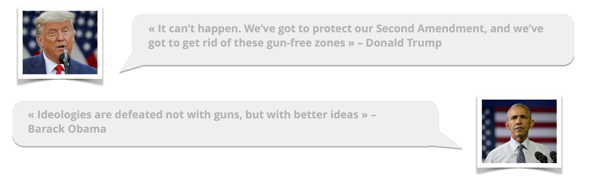

<head>
 
</head>

Gun control is one of the most controversial political topics in the United States. Being one of the world’s most liberal countries in the world, freedom one of its core values. But gun ownership and the need for regulation can seem incompatible at times.

**How is this political debate linked to the occurrences of mass shootings? This is what we intend to find out.**

Analyzing quotes emanating from American newspapers in the [Quotebank dataset](https://quotebank.dlab.tools) combined with [additional data](https://www.motherjones.com/politics/2012/12/mass-shootings-mother-jones-full-data/) will help us study how these tragic events influence the media coverage and the political debate. 

<h1 style="color: #990000;">Are quotes about guns related to the occurence of mass shootings?</h1>

Between 2015 and 2020, **48 mass shootings** were registered, killing 396 people and injuring 895. In the same timeframe, we collected more than **79'000 quotes** from American news that were about guns and shootings in general (LINK to how we collected these quotes). The first thing we wanted to see is if the occurences of these quotes was linked to the events.

<iframe src="time_fatalities.html" width="100%" height=620 frameBorder="0"></iframe>

This plot shows us several interesting things. For instance, some **clear peaks in quotes seem to follow after most of the shootings**. The largest peak in fatalities happens around October 2017 and is followed by the second largest peak in quotes talking about guns.

The plot seems to make it clear that there is a correlation between the occurences of mass shootings and the number of quotes in the following days. **To confirm our intuition, we performed a Pearson correlation test** between the number of quotes on a given day and the number of days since the last shooting. This revealed a highly significant (p-value << 0.05) negative correlation between the number of quotes on a given day and the days since the last shooting. This was the expected result: **the more days since the last shooting, the rarer the quotes talking about guns and firearms**.

<h1 style="color: #990000;">What words were used the most after the shootings?</h1>

We tried a machine learning approach to isolate the words that were the most related to the mass shootings. Using random forests, we selected words by features importance. This is what we got : 

[insert image]

even though the results are not very significative, we may be seing some pattern emerging. **Talk about state** and words like '**help**'. 

<h1 style="color: #990000;">What shootings generated the most reaction?</h1>

For each shooting, we defined a **reaction score**. The reaction score was computed as the **relative increase** between the total number of quotes during the 10 days before the shooting and the total number of quotes during the 10 days after the shooting. Although imperfect, it captures how much more (or less) the media have been talking about guns after the shooting.

The following map shows all 48 shootings by location. **The larger the circle, the larger the corresponding media outrage**. You can hover each point to get extra information about the shooting (location type, weapon type, gender of shooter...).
<iframe src="map.html" width="100%" height=500 frameBorder="0"></iframe>

<h1 style="color: #990000;">What features are likely to influence the reaction?</h1>

Some shootings made it very clear, **the number of fatalities is not the only factor that influences the amount of reaction generated** by a shooting. Indeed, the most influential shooting according to our reaction score had only 3 fatalities. Differences like the location of the shooting (e.g. School, Religious place, Workplace) and the weapon type can influence the following media outrage, covering and debate.

We ran **correlation tests** between the features and the reaction score. Very few showed to be significant (p-values were mostly larger than 0.05). But we have little data: for example, their are only three School shootings, so it is hard to find a pattern. The take-home message is simply that there are many factors that influence the amount of reaction a shooting generates, and that an exact correlation can not be found partly because of the lack of data and the lack of correlation simply.

The **shooting situation that should generate the most reaction**: shooting in airport with a high number of fatalities, shooter is an Asian male with a legal automatic weapon. 
The **shooting situation that should generate the least reaction**: shooting in workplace with a small number of fatalities, shooter is a white female with an illegal  weapon.

Disclaimer: these predictions are probably incorrect. Indeed, there are probably correlations between the features as well, and it might be that it is the combination of features that trigger large reactions, rather than the sum of individual influences. For example, the fact that the reaction score is on average higher for male shooters does not mean that the media is taking the gender of the shooter into account. Although there might be a link between the media's interest and the gender of the shooter, there might also be a correlation between the gender and other features, such as the number of fatalities (male shooters generating more fatalities on average).

However, these results still give an insight on some things that can trigger a larger reaction.

<h1 style="color: #990000;">Who speaks the most about guns?</h1>

In this section we will provide insights about profiles of speakers. As we did before, we will consider only quotes that are linked with the gun debate 10 days following each shooting recorded in the [additional data](https://www.motherjones.com/politics/2012/12/mass-shootings-mother-jones-full-data/). We focused on the 2 main following categories : gender and political party. As we wanted to highlight the polarization of the debate, we kept categories binary. Namely, looking only at male and female genders and Republican and Democratic parties.

We can observe that women are not represented as much as men after shootings. In fact, a huge part of the debate is "invaded" by men. As a result, the debate seems to split equally between democrats and republicans. The media sphere seems to be equally occupied by these two parties after shootings.
Further analysis has been performed in order to see whether there was a correlation between reaction score and the share of quotes of a specific party on single shootings. It unfortunately turned out to be irrelevant.

<h1 style="color: #990000;">Conclusion</h1>

Margaux.

----
Thank you for your interest!
The Cle(ment)Ze(wei)Ma(rgaux)Th(omas) team

