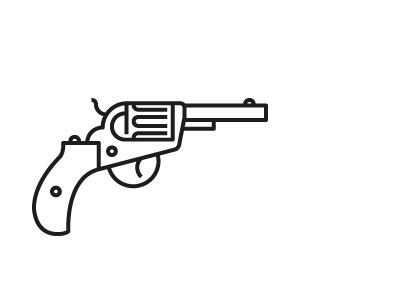

# Firearms Debate in the US and its Relationship to Mass Shootings

Gun control is one of the most controversial political topics in the United States. Being one of the world’s most liberal countries in the world, freedom one of its core values. But gun ownership and the need for regulation can seem incompatible at times. 

some *blue* text.

**How is this political debate linked to the occurrences of mass shootings? This is what we intend to find out.**

Analyzing quotes emanating from American newspapers in the Quotebank dataset combined with additional data will help us study how these tragic events influence the media coverage and the political debate. 

## Media coverage: are quotes about guns related to the occurence of mass shooting?

Between 2015 and 2020, 48 shootings were registered, killing ??? people and injuring ???. In the same timeframe, we collected ??? quotes about guns and shootings in general. The first thing we wanted to see is if the occurences of these quotes was linked to the events.

insert interactive bar chart with quotes/fatalities over time
insert correlation information

## What words are used to describe the shootings?

Margaux

## What shootings generated the most reaction?

The following map shows all 48 shootings by location. The larger the circle, the larger the corresponding media outrage.
<iframe src="map.html" width="100%" height=500></iframe>

## What features are likely to influence the reaction?

List of features and show plots about average reaction score by feature

----

## Data used

As our goal was to analyse the relationship between mass shootings and _ _talk_ _ about mass shootings we had to use two different datasets. For the shootings, we used the **"Mother Jone's" dataset**, that we got from https://data.world/awram/us-mass-shootings. This dataset gave us basic information (e.g. date, number of fatalities) about each shooting that occured in the USA between 2015 and 2020, adding also some interesting features such as location, age and gender of the shooter, etc. Our other source of data was the **Quotebank data set** [INSERT REF], consisting of over 170 mio of quotes emanating from american newspapers. We focused our research on the time lapse between 2015 and 2020. 

## Media coverage : Do newspapers quote more people talking about firearms and gun violence after a mass shootings ? 

Our first question was to see if we can spot an augmentation of quotes talking about firearms or gun violence in the days following a mass shooting. To this end, we subsetted all the quotes from the Quotebank data containing the **words 'gun', 'firearm', 'shoot', 'terrorist', 'terrorism'**. By plotting this subset together with the occurences of mass shootings, this is the **timeline** we get : 

!INSERT timeline quotes/shootings

This plot shows us several interesting things. For example, the largest peak in fatalities happens around october 2017. It is followed by the second largest peak in quotes talking about guns. We can also see that the peak of quotes is generally maximal two days after the shooting.

### Correlation between mass shootings and number of quotes
 To show that there is an association between the occurences of mass shootings (in orange) and the number of quotes in our subset (in blue), we performed a Pearson correlation test between the number of quotes in the subset and the number of days since the last shooting. This revealed a highly significant (p-value << 0.05) **negative correlation** between the number of quotes on a given day and the days since the last shooting. This was the expected result: **the more days since the last shooting, the rarer the quotes talking about guns and firearms**.

## Zoom on 2018 : Influence of the number of fatalities on the count of quotes

With the above plot, we can see that the most important peak of quotes seems to take place just after a shooting in early 2018. So let's zoom in a little !

! INSERT timeline quotes/shootings 2018

It seams that this particular event has made much more noise then the others and over a larger period of time. The fact that it was **certainly not the shooting with the most fatalities** ("only" 17, compared to 58 for the max) shows that the number of fatalities is clearly not the only parameter that influences the media coverage of the event as well as the amplitude of the discussion on gun control afterwards.

**This makes us want to investigate further: what are the other factors that can explain these differences?** Some ideas: 
- Location of the shooting (what state, but also what type of place: e.g. at a school, workplace...)
- Wheather of not the weapon was bought legally
- Age, gender and ethnicity of the shooter and/or the victims
- The type of weapon that was used
- etc.

## What are the relevant features to predict "media coverage" ? 

(PCA - yet to do)

## Computing the reaction score 

TO FILL 

## Further analysis : Machine Learning based analysis of word occurences

We have conducted some preliminary analysis with our subset of quotes, containing the words 'shoot, gun, firearm'. We have seen that these words are indeed correlated with events of mass shootings.

But now let's "reverse" the analysis, and check **what are the words that are associated the most with the occurences of mass shootings**. 
